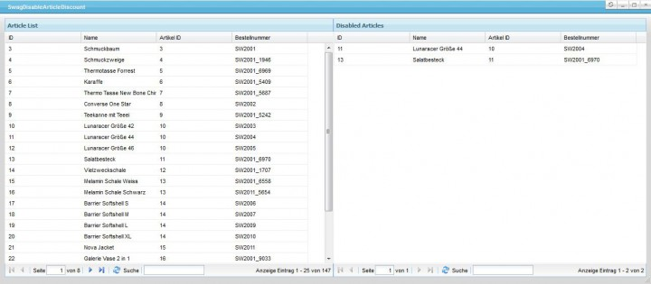

# SwagDisableArticleDiscount

## Description

This plugin makes it possible to exclude items from being discounted in the shopping cart (preferences/customer groups). 
These items are presented in a clear table and are easy to add/remove.

**Note:** item variants are not supported in the current version.

## Images

## License

The MIT License (MIT). Please see [License File](LICENSE) for more information.
